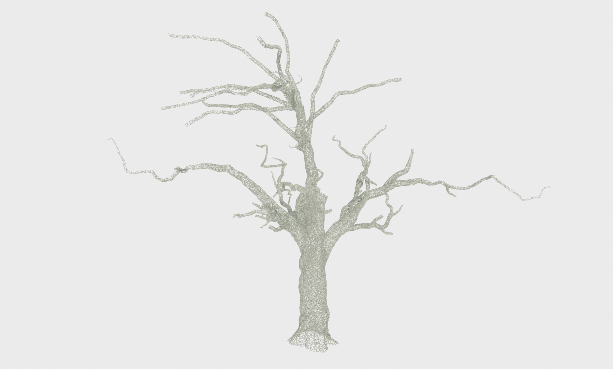
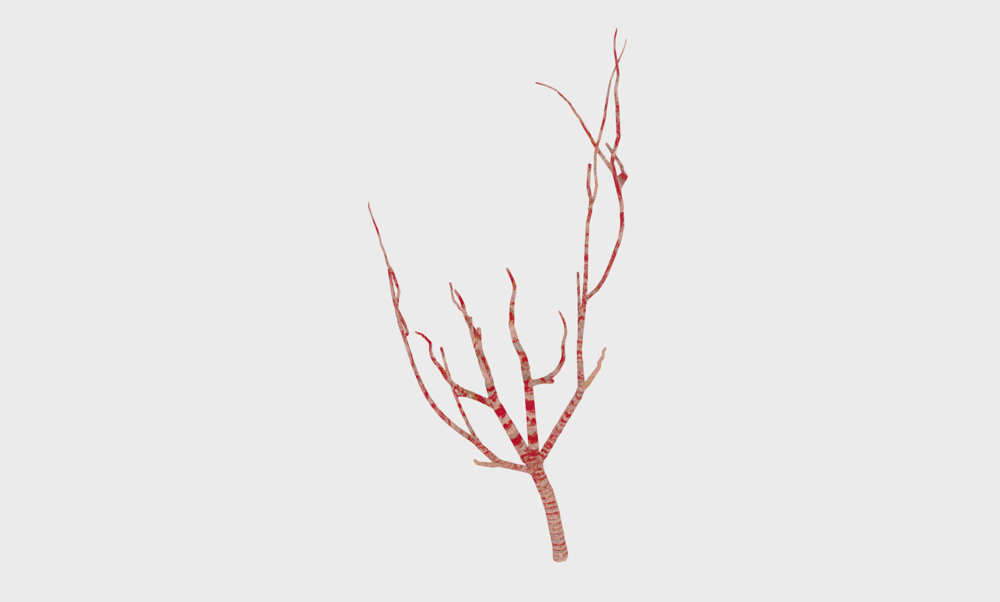
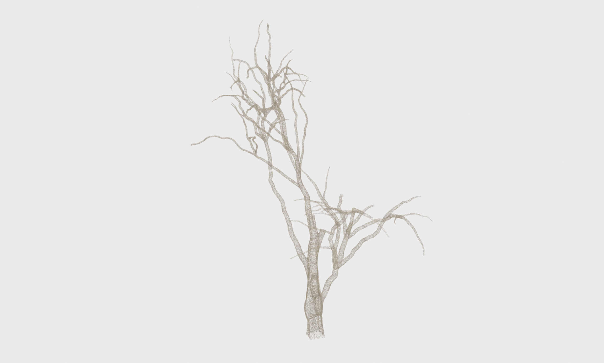
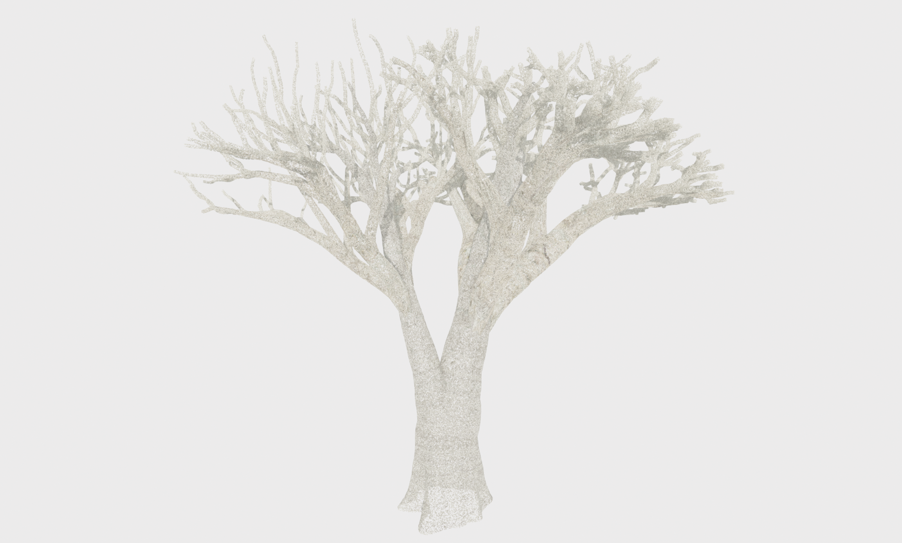
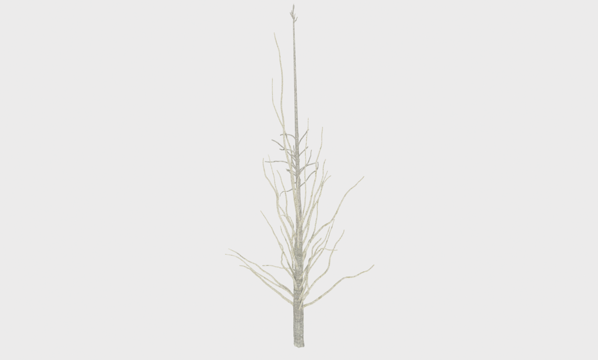
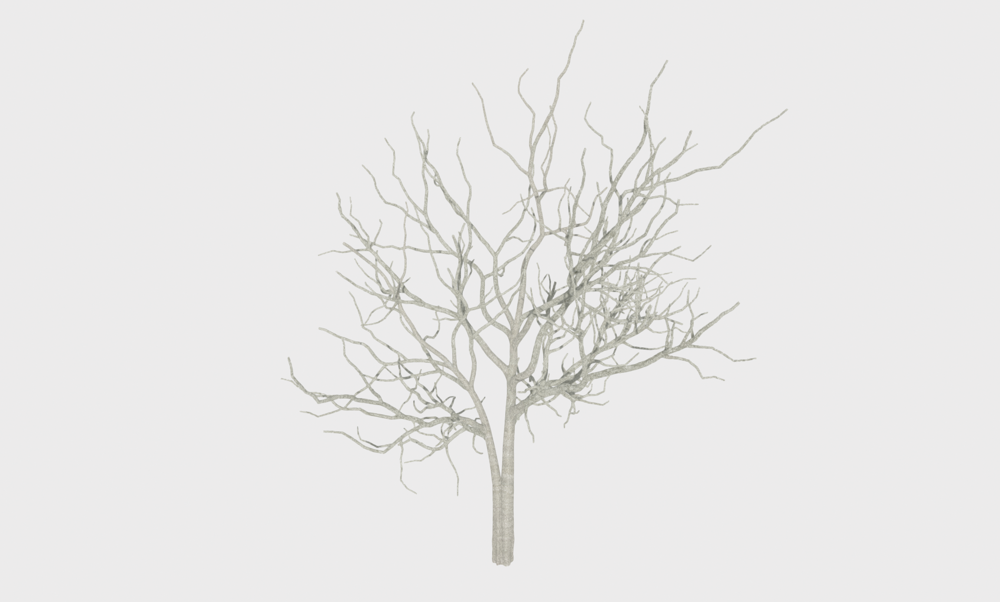
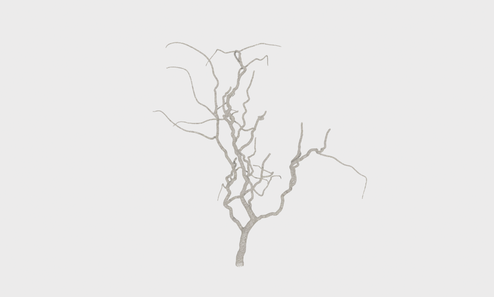
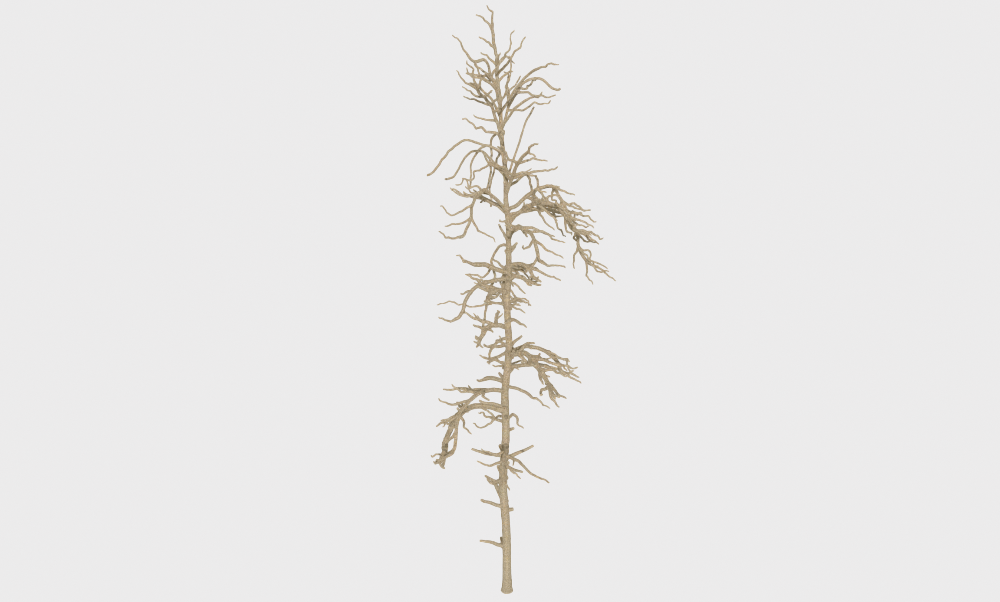
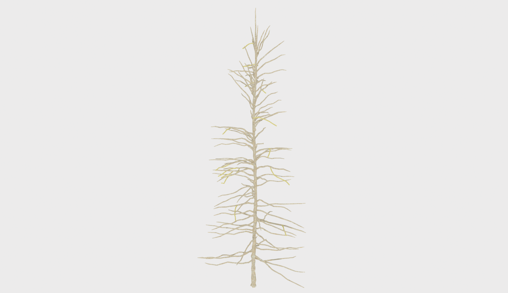
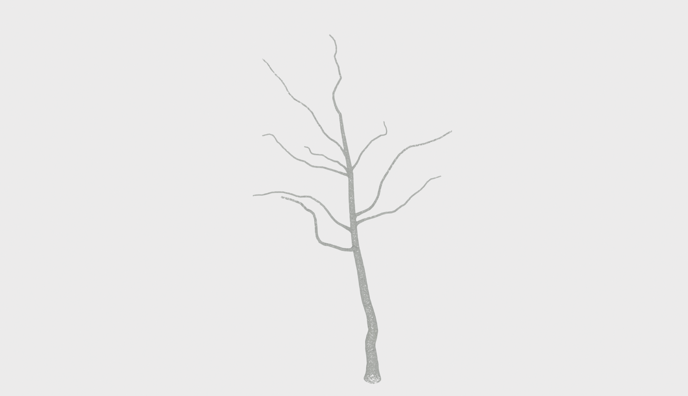

# <center> 🌿🌳🌱 Synthetic-Trees-II 🌱🌳🌿 </center>

## 📖 Description
This repository offers a synthetic point cloud dataset with ground truth skeletons of multiple species. 

## 🖼️ Images
Below are some images of point clouds from the dataset:

<div align="center">
    <p float="left">
      
       
      
      
    </p>
    <p float="left">
      
      
      
      
    </p>
    <p float="left">
      
      
      <!-- Add more images if needed -->
    </p>
</div>


## 💿 Download
You can download the data by following this [link](https://ucliveac-my.sharepoint.com/:f:/r/personal/oliver_batchelor_canterbury_ac_nz/Documents/tree_dataset2?csf=1&web=1&e=fSJeTj).

### 🔗 Dependencies
Our dataset uses subtractive augmentations based on Perlin Noise.<br>
We offer a GPU-based implementation of Perlin Noise, available in this [repository](https://github.com/uc-vision/taichi_perlin).<br>
For data visualization, we recommend our previously developed library, accessible via this [link](https://github.com/uc-vision/synthetic-trees).<br>
An example augmentation can be done using `python augmentation.py`

## 📄 Citation 
Please use the following BibTeX entry to cite our work: <br>

```
@article{dobbs2024quantifying,
  title={Quantifying robustness: 3D tree point cloud skeletonization with smart-tree in noisy domains},
  author={Dobbs, Harry and Batchelor, Oliver and Peat, Casey and Atlas, James and Green, Richard},
  journal={Pattern Analysis and Applications},
  volume={27},
  number={1},
  pages={28},
  year={2024},
  publisher={Springer}
}
```


## 📩 Contact 
Should you have any questions, comments or suggestions please use the following contact details:
harry.dobbs@pg.canterbury.ac.nz


